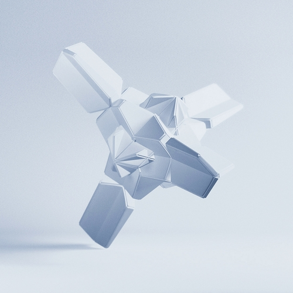

# 製作團隊

<h3>Aozaki</h3>

 

[ [<i class="fab fa-twitter" /> Twitter](https://twitter.com/Aozaki__) ] [ [<i class="fas fa-feather-alt" /> Blog](https://aozaki.cc/) ]

星詠者，網站製作者，英語與簡體中文編撰

如果本指南有幫助到您，請考慮在 [<i class="fas fa-coffee" /> Ko-Fi.com](https://ko-fi.com/project_stargazer) 支援本項目。

---

<h3>Mikaze</h3>

 

[ [<i class="fab fa-twitter" /> Twitter](https://twitter.com/mikaze0322) ] [ [<i class="fab fa-youtube" /> YouTube](https://www.youtube.com/channel/UCrpkt3YHPdpciDy-96H_2mg) ]

星詠者，翻譯，烤肉Man，繁體中文編撰

---

 

本項目是 *Project Stargazer* 的一部分。

本家使用 [VuePress](https://v2.vuepress.vuejs.org/zh/) 搭建，托管於 [Vercel](https://vercel.com/) 上。

搜尋系統為 [DocSearch](https://docsearch.algolia.com/) 提供。
